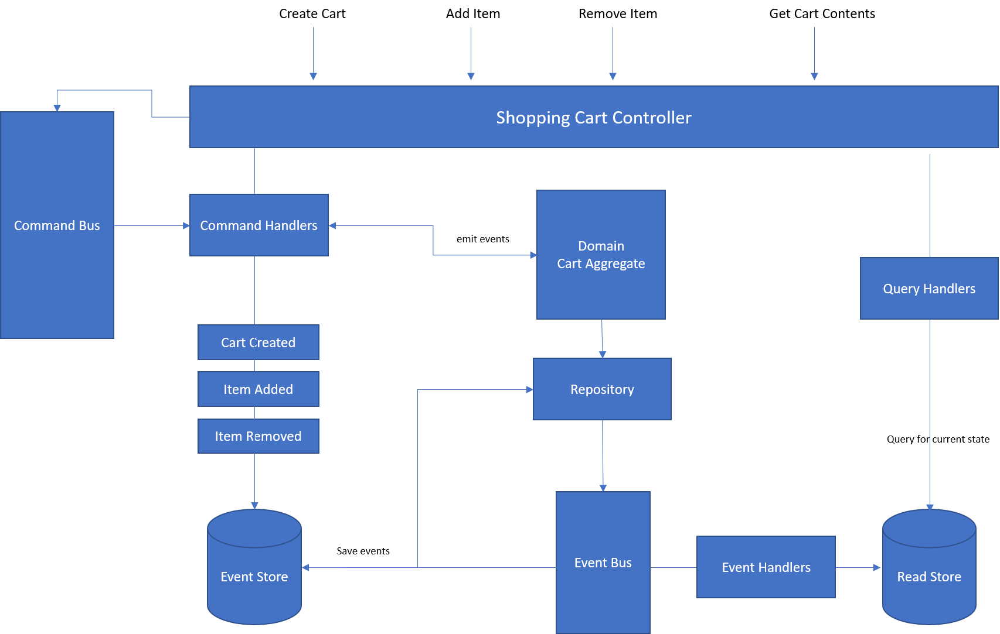

# Shopping Cart

An application that uses Command Query Responsibility Segregation (CQRS) and Event Sourcing to implement a shopping cart system using the [OpenCQRS](https://github.com/OpenCQRS) framework.

**Features**

- Event Store and Read Model/Database using EntityFramework Core (InMemory Provider)
- Native .NET Core Dependency Injection
- [Swashbuckle](https://github.com/domaindrivendev/Swashbuckle.AspNetCore) to generate API documentation + UI to explore and test endpoints
- [AutoRest](https://github.com/Azure/autorest) to generate a client library
- Validation with [FluentValidation](https://github.com/JeremySkinner/FluentValidation)
- Native .NET Core Dependency Injection

## Install

Core Requirements

- .NET Core 2.1

Optional Requirements

- Docker

### Usage

```sh
# build
dotnet build -c Release -o src/ShoppingCart.WebApi

# start the app
dotnet src/ShoppingCart.WebApi/bin/Release/netcoreapp2.1/ShoppingCart.WebApi.dll

# access
https://localhost:5001 # -- this will open Swagger UI
```

Running on Docker

```sh
dotnet restore
dotnet publish -o publish -c Release
docker build -t djamseed/shopping-cart-api .
docker run -it --rm -p 5000:80 -t djamseed/shopping-cart-api .

#access
http://localhost:5000 # -- this will open Swagger UI
```

## Architecture

Based on the Onion Architecture


---

CQRS/ES using [OpenCQRS](https://github.com/OpenCQRS)



## API Endpoints

### Create Cart

```curl
POST /api/v1/cart
```

```json
{
  "customerId": "90ab0d48-6253-4189-a7c2-24f1f8862809"
}
```

### Add to Cart

```curl
POST /api/v1/cart/{cartId}
```

```json
{
  "productName": "item-1",
  "price": 500,
  "quantity": 2
}
```

### Update Item Quantity

```curl
PUT /api/v1/cart/{cartId}
```

```json
{
  "productName": "item-1"
  "quantity": 5
}
```

### Remove from Cart

```curl
DELETE /api/v1/cart/{cartId}
```

```json
{
  "productName": "item-1"
}
```

### Clear Cart

```curl
DELETE /api/v1/cart/{cartId}/clear
```

## Assumptions

- Customer already have an account and is authenticated
- Stock management is done externally

## Notes

- API doc is available via Swagger and testing can be done by Swagger UI (https://localhost5001)
